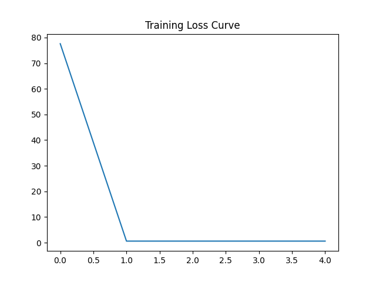
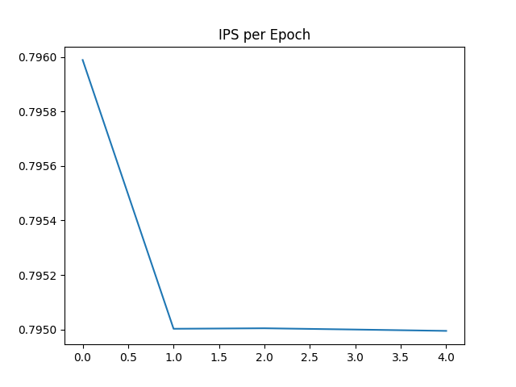
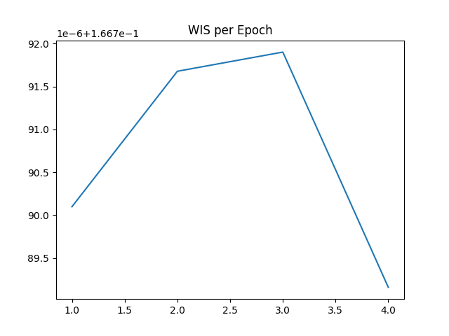
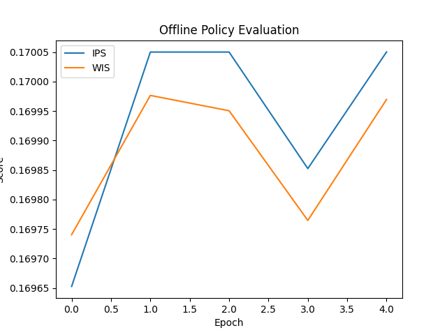
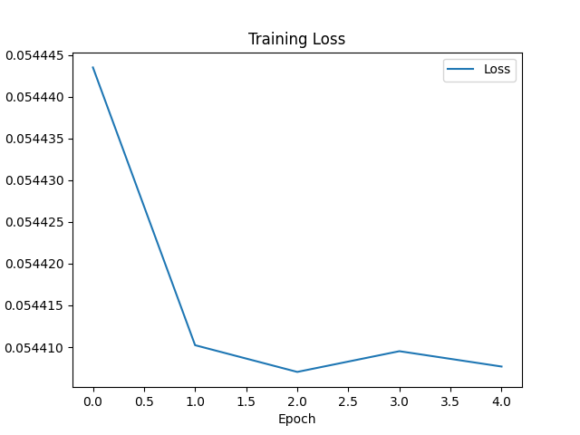

# Contextual Bandit Learning on Avazu CTR Dataset
This repository implements a contextual bandit framework using the Avazu Click-Through Rate (CTR) dataset. The goal is to learn a policy that selects optimal banner positions to maximize user click probability.

---

### 🚀 Overview

We reformulate the CTR prediction problem as a contextual bandit task:

Context (X): Encoded ad + user features
Action (A): banner_pos
Reward (R): click (0 or 1)

A neural network policy is trained to model action probabilities, and performance is evaluated using off-policy evaluation metrics:

IPS (Inverse Propensity Scoring)
WIS (Weighted Importance Sampling)
🧠 Model

The policy is a simple feedforward neural network:

Fully connected layers with ReLU activations
Outputs logits over discrete actions (banner positions)
Softmax used to derive action probabilities

### 📊 Dataset

This project uses the Avazu CTR dataset, which is not included due to its large size (multiple GBs).

Expected format:
CSV file
Must include:
click (reward)
banner_pos (action)
Other categorical features (automatically encoded)

---

### Setup:

Place your dataset at:
data/train.csv

---

### ⚙️ Configuration

All parameters are controlled via:

configs/config.yaml

---

### Example:

train:
  batch_size: 256
  epochs: 5
  lr: 0.001
  device: "cuda"

model:
  hidden_sizes: [128, 64]
  num_actions: 8

data:
  path: data/train.csv
  nrows: null

---

### 🏋️ Training

Run training with:

python train.py

During training, the following are tracked:

Cross-entropy loss
IPS estimate
WIS estimate

---

### 📈 Outputs

After training:

Model checkpoint:

models/policy.pt

Training curves:

---

### 🧪 Evaluation

Evaluation is performed offline using logged bandit data:

Assumes uniform behavior policy
Computes:
IPS: unbiased but high variance
WIS: normalized, lower variance

---

## Author

**Hardik Singh**  
MSc Data Management & Artificial Intelligence  
